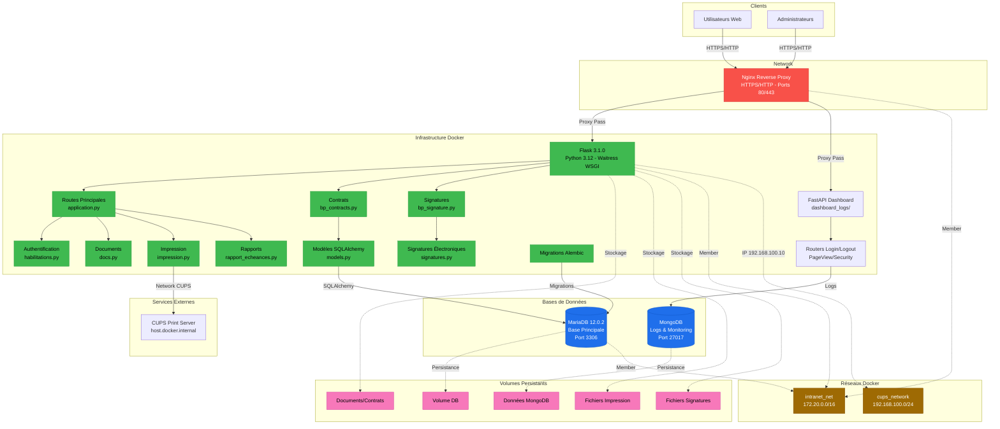

# Architecture Globale du Projet Intranet

Ce diagramme présente l'architecture complète du système Intranet, incluant les composants frontend, backend, bases de données et infrastructure Docker.

## Composants Principaux

### Frontend

- Interface web responsive (HTML/CSS/JS)
- Bibliothèques : Bootstrap 5.3.3, jQuery 3.7.1, SignaturePad 4.1.7, PDF.js 3.11.174

### Backend Flask (Python 3.12)

- **Routes principales** : Gestion utilisateurs, authentification, accueil
- **Module Contrats** : CRUD complet des contrats avec contacts et factures
- **Module Signatures** : Placement de points, capture graphique, génération de PDF signés
- **Impression** : Impression à distance via CUPS
- **Rapports** : Génération de rapports d'échéances

### Dashboard Logs (FastAPI)

- API de monitoring et analyse des logs
- Routers : Login, Logout, PageView, Security

### Bases de Données

- **MariaDB 12.0.2** : Données métier (utilisateurs, contrats, signatures, factures)
- **MongoDB** : Logs d'activité et monitoring

### Infrastructure Docker

- **4 conteneurs** : nginx (proxy), web (Flask), db (MariaDB), mongodb
- **Volumes persistants** : Base de données, documents, impressions, signatures
- **Réseaux isolés** : intranet_net (172.20.0.0/16), cups_network (192.168.100.0/24)

## Flux de Données

1. Les utilisateurs accèdent à l'application via HTTPS (Nginx)
2. Nginx route les requêtes vers Flask ou FastAPI
3. Flask interagit avec MariaDB via SQLAlchemy
4. Les logs sont envoyés vers MongoDB via FastAPI
5. Les fichiers sont stockés dans des volumes Docker persistants
6. L'impression se fait via le réseau CUPS
