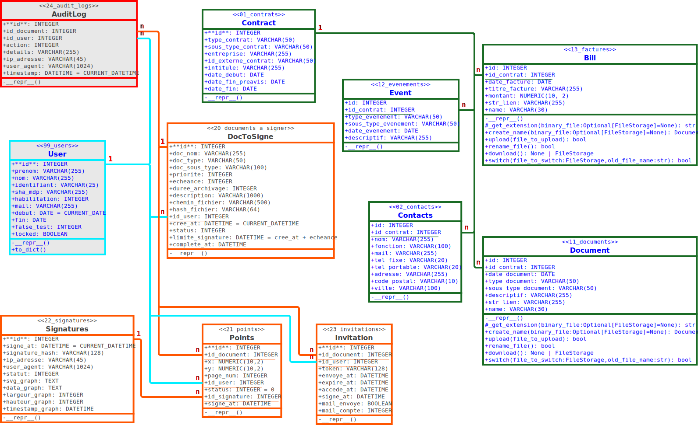

# 🏗️ Architecture

---

## Stack technologique

- **Backend** : Flask 3.1.0 (Python 3.12)
- **Base de données** : MariaDB (MySQL) 12.0.2
- **ORM** : SQLAlchemy 2.0.38
- **Migrations** : Alembic 1.16.5
- **Serveur web** : Waitress + Nginx (reverse proxy)
- **Conteneurisation** : Docker & Docker Compose
- **Sécurité** : Hachage SHA-256, sessions Flask, HTTPS

---

## Structure du projet

```text
.
├── alembic/                          # ⚗️ Migrations de la base de données
│   ├── versions/                     # Scripts de migration versionnés
│   │   ├── b5f240cb2287_renommage_des_champs_camelcase_en_snake_.py
│   │   └── c8293d28c674_ajout_de_la_table_13_factures.py
│   ├── env.py                        # Configuration de l'environnement Alembic
│   └── script.py.mako                # Template pour nouveaux scripts de migration
├── app/                              # 🐍 Application Flask principale
│   ├── __init__.py                   # 🚀 Initialisation Flask + configuration
│   ├── application.py                # 🛣️ Routes principales et logique métier
│   ├── bp_contracts.py               # 📋 Blueprint pour la gestion des contrats
│   ├── bp_signature.py               # ✍️ Blueprint pour le système de signatures
│   ├── config.py                     # ⚙️ Configuration Flask et variables d'environnement
│   ├── docs.py                       # 📄 Gestion des documents et téléchargements
│   ├── habilitations.py              # 🔐 Système d'habilitations et permissions
│   ├── impression.py                 # 🖨️ Système d'impression à distance
│   ├── models.py                     # 🗄️ Modèles SQLAlchemy et structure BDD
│   ├── rapport_echeances.py          # 📊 Génération des rapports d'échéances
│   ├── run.py                        # 🚀 Point d'entrée principal de l'application
│   ├── signatures.py                 # ✍️ Logique métier pour les signatures électroniques
│   ├── utilities.py                  # 🔧 Fonctions utilitaires et helpers
│   ├── json/                         # 📋 Fichiers de configuration JSON
│   │   ├── admin_modules.json        # Configuration des modules d'administration
│   │   ├── menus.json                # Structure et typologie des menus
│   │   └── modules.json              # Configuration des modules métier
│   ├── nginx/                        # 🌐 Configuration serveur web
│   │   └── nginx.conf                # Configuration principale Nginx
│   ├── static/                       # 🎨 Ressources statiques
│   │   ├── css/                      # 🎨 Feuilles de style CSS
│   │   │   ├── style-accueil.css     # Styles page d'accueil
│   │   │   ├── style-contrats.css    # Styles module contrats
│   │   │   ├── style-general.css     # Styles généraux de l'application
│   │   │   ├── style-impression.css  # Styles module impression
│   │   │   ├── style-login.css       # Styles page de connexion
│   │   │   ├── style-menu.css        # Styles navigation et menus
│   │   │   ├── style-signature.css   # Styles module signatures
│   │   │   └── style-tableau.css     # Styles tableaux de données
│   │   ├── js/                       # 📱 Scripts JavaScript côté client
│   │   └── img/                      # 🖼️ Images et icônes de l'interface
│   ├── templates/                    # 📄 Templates Jinja2
│   │   ├── contrats.html             # Liste des contrats
│   │   ├── contrat_detail.html       # Détail d'un contrat
│   │   ├── ea.html                   # Template EA (Évènements/Actions)
│   │   ├── ei.html                   # Template EI (Entités/Individus)
│   │   ├── ere.html                  # Template ERE (Événements/Rapports/Échéances)
│   │   ├── erp.html                  # Template ERP (Entreprise/Ressources/Planning)
│   │   ├── erpp.html                 # Template ERPP (extension ERP)
│   │   ├── gestion_droits.html       # Gestion des droits utilisateurs
│   │   ├── gestion_utilisateurs.html # Administration des utilisateurs
│   │   ├── index.html                # Tableau de bord principal
│   │   ├── login.html                # Page de connexion
│   │   ├── mail_echeance.html        # Template emails d'échéances
│   │   └── signatures/               # Templates module signatures
│   │       ├── signature_do.html     # Interface de signature
│   │       └── signature_make.html   # Création de signatures
│   ├── Dockerfile.app                # 🐳 Image Docker de l'application
│   └── entrypoint.sh                 # � Script de démarrage du conteneur
├── backup/                           # � Scripts et outils de sauvegarde
│   ├── README.md                     # Documentation des sauvegardes
│   ├── simple-backup.sh              # Script de sauvegarde simple
│   └── simple-restore.sh             # Script de restauration simple
├── database/                         # 🗄️ Configuration et scripts BDD
│   ├── CHANGELOG.md                  # Historique des versions de la BDD
│   ├── Dockerfile.mariadb            # 🐳 Image Docker MariaDB personnalisée
│   └── init_user.sql                 # Script de création utilisateur admin initial
├── documentation/                    # 📚 Documentation technique du projet
│   ├── rapport-evolution-branches.md # Rapport d'évolution des branches Git
│   ├── UML_BdD.dia                   # Diagramme UML de la base (format Dia)
│   └── UML_BdD.svg                   # Diagramme UML de la base (format SVG)
├── documents/                        # 📁 Stockage des fichiers uploadés
│   └── signatures/                   # Documents de signatures électroniques
│       └── temp/                     # Fichiers temporaires de signatures
├── print/                            # 🖨️ File d'attente d'impression
├── test/                             # 🧪 Tests unitaires et d'intégration
│   ├── conftest.py                   # Configuration pytest
│   ├── fixtures.py                   # Fixtures pour les tests
│   ├── pytest.ini                    # Configuration pytest
│   ├── README.md                     # Documentation des tests
│   ├── test_application.py           # Tests de l'application principale
│   └── test_mock_session_refactoring.py # Tests de refactoring des sessions
├── venveraudiere/                    # 🐍 Environnement virtuel Python
│   ├── Include/                      # Headers Python
│   ├── Lib/                          # Bibliothèques Python
│   │   └── site-packages/            # Packages installés
│   ├── Scripts/                      # Exécutables (Windows)
│   │   ├── activate                  # Script d'activation (Unix)
│   │   ├── activate.bat              # Script d'activation (Windows)
│   │   ├── Activate.ps1              # Script d'activation (PowerShell)
│   │   ├── flask.exe                 # Exécutable Flask
│   │   ├── python.exe                # Interpréteur Python
│   │   └── pip.exe                   # Gestionnaire de packages
│   └── pyvenv.cfg                    # Configuration de l'environnement virtuel
├── alembic.ini                       # ⚙️ Configuration des migrations Alembic
├── CODE_OF_CONDUCT.md                # 📜 Code de conduite du projet
├── CONTRIBUTING.md                   # 📋 Guide de contribution
├── docker-compose.dev.yaml           # 🐳 Composition Docker pour développement
├── docker-compose.yaml               # 🐳 Orchestration des services Docker (production)
├── generate-env.sh                   # 🔐 Script de génération automatique du .env
├── INSTALL.md                        # 📋 Guide d'installation détaillé
├── LICENCE.md                        # 📜 Licence MIT du projet
├── README.md                         # 📖 Documentation principale
├── requirements.txt                  # 🐍 Dépendances Python
├── SECURITY.md                       # 🔒 Politique de sécurité
└── todo.md                           # � Liste des tâches et améliorations à venir
```

---

## Structure de la base de données



[<- Retour au README](../README.md)
