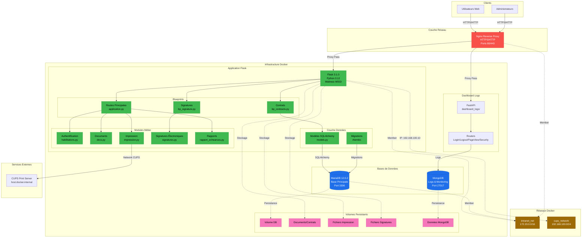

# Architecture globale

```mermaid
graph TB
    subgraph "Clients"
        USER[Utilisateurs Web]
        ADMIN[Administrateurs]
    end

    subgraph "Couche Réseau"
        NGINX[Nginx Reverse Proxy<br/>HTTPS/HTTP<br/>Ports 80/443]
    end

    subgraph "Infrastructure Docker"
        subgraph "Application Flask"
            FLASK[Flask 3.1.0<br/>Python 3.12<br/>Waitress WSGI]
            
            subgraph "Blueprints"
                BP_MAIN[Routes Principales<br/>application.py]
                BP_CONTRACTS[Contrats<br/>bp_contracts.py]
                BP_SIGNATURE[Signatures<br/>bp_signature.py]
            end
            
            subgraph "Modules Métier"
                AUTH[Authentification<br/>habilitations.py]
                DOCS[Documents<br/>docs.py]
                PRINT[Impression<br/>impression.py]
                SIGS[Signatures Électroniques<br/>signatures.py]
                REPORTS[Rapports<br/>rapport_echeances.py]
            end
            
            subgraph "Couche Données"
                MODELS[Modèles SQLAlchemy<br/>models.py]
                ALEMBIC[Migrations<br/>Alembic]
            end
        end
        
        subgraph "Dashboard Logs"
            FASTAPI[FastAPI<br/>dashboard_logs/]
            FASTAPI_ROUTERS[Routers<br/>Login/Logout/PageView/Security]
        end
        
        subgraph "Bases de Données"
            MARIADB[(MariaDB 12.0.2<br/>Base Principale<br/>Port 3306)]
            MONGODB[(MongoDB<br/>Logs & Monitoring<br/>Port 27017)]
        end
        
        subgraph "Volumes Persistants"
            VOL_DB[Volume DB]
            VOL_DOCS[Documents/Contrats]
            VOL_PRINT[Fichiers Impression]
            VOL_SIG[Fichiers Signatures]
            VOL_MONGO[Données MongoDB]
        end
    end

    subgraph "Réseaux Docker"
        NET_INTRANET[intranet_net<br/>172.20.0.0/16]
        NET_CUPS[cups_network<br/>192.168.100.0/24]
    end

    subgraph "Services Externes"
        CUPS[CUPS Print Server<br/>host.docker.internal]
    end

    %% Connexions Utilisateurs
    USER -->|HTTPS/HTTP| NGINX
    ADMIN -->|HTTPS/HTTP| NGINX
    
    %% Connexions Nginx
    NGINX -->|Proxy Pass| FLASK
    NGINX -->|Proxy Pass| FASTAPI
    
    %% Connexions Flask internes
    FLASK --> BP_MAIN
    FLASK --> BP_CONTRACTS
    FLASK --> BP_SIGNATURE
    
    BP_MAIN --> AUTH
    BP_MAIN --> DOCS
    BP_MAIN --> PRINT
    BP_MAIN --> REPORTS
    BP_CONTRACTS --> MODELS
    BP_SIGNATURE --> SIGS
    
    %% Connexions Base de données
    MODELS -->|SQLAlchemy| MARIADB
    ALEMBIC -->|Migrations| MARIADB
    
    %% Connexions Dashboard
    FASTAPI --> FASTAPI_ROUTERS
    FASTAPI_ROUTERS -->|Logs| MONGODB
    
    %% Volumes
    MARIADB -.->|Persistance| VOL_DB
    FLASK -.->|Stockage| VOL_DOCS
    FLASK -.->|Stockage| VOL_PRINT
    FLASK -.->|Stockage| VOL_SIG
    MONGODB -.->|Persistance| VOL_MONGO
    
    %% Impression
    PRINT -->|Network CUPS| CUPS
    
    %% Réseaux
    FLASK -.->|Member| NET_INTRANET
    FLASK -.->|IP: 192.168.100.10| NET_CUPS
    MARIADB -.->|Member| NET_INTRANET
    NGINX -.->|Member| NET_INTRANET

    classDef flaskClass fill:#3fb950,stroke:#2ea043,color:#000
    classDef dbClass fill:#1f6feb,stroke:#1158c7,color:#fff
    classDef nginxClass fill:#f85149,stroke:#da3633,color:#fff
    classDef volumeClass fill:#f778ba,stroke:#d54ba5,color:#000
    classDef networkClass fill:#9e6a03,stroke:#845306,color:#fff
    
    class FLASK,BP_MAIN,BP_CONTRACTS,BP_SIGNATURE,AUTH,DOCS,PRINT,SIGS,REPORTS,MODELS,ALEMBIC flaskClass
    class MARIADB,MONGODB dbClass
    class NGINX nginxClass
    class VOL_DB,VOL_DOCS,VOL_PRINT,VOL_SIG,VOL_MONGO volumeClass
    class NET_INTRANET,NET_CUPS networkClass
```
